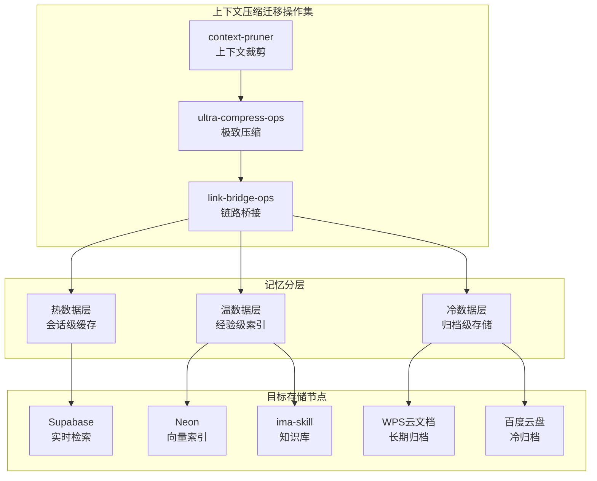

# 上下文压缩迁移操作集方案

- 档号：DF-CTX-COMPRESS-2026-1007-YANJIAN-01
- 拟稿席：砚坚（挂帅席/神经中枢）
- 日期：2026-10-07T07:55 CST
- 体例：党组学术技术成员视角
- 依据：Kubernetes Context7文档范式、机主2026-10-07全局声明

## 一、操作集定义

### （一）核心技能操作

| 操作 | 标识 | 功能 | 输入 | 输出 |
|------|------|------|------|------|
| 上下文裁剪 | `\context-pruner` | 识别并移除冗余信息（重复指令、已过期事项、无关上下文） | 完整上下文 | 裁剪后上下文+裁剪日志 |
| 极致压缩 | `\ultra-compress-ops` | 将长文档压缩为结构化摘要，保留关键决策/数据/链接 | 长文档（>5K字） | <500字摘要+压缩比报告 |
| 链路桥接 | `\link-bridge-ops` | 建立压缩摘要与原始文档的桥接链接，确保可追溯 | 摘要+原文路径 | 桥接索引（摘要→原文映射） |

### （二）目标存储节点

| 节点 | 用途 | 数据类型 | 协议 |
|------|------|---------|------|
| WPS云文档 | 长期归档+跨端协同 | OTL格式文档 | WPS OpenAPI |
| Neon | 向量索引+结构化数据 | 经验向量、决策记录 | PostgreSQL |
| Supabase | 实时检索+API服务 | 热温层数据 | REST/GraphQL |
| ima-skill | 知识库沉淀 | 技能文档、参考材料 | ima OpenAPI |
| 百度云盘 | 冷归档备份 | 完整会话记录 | 百度网盘API |

### （三）可交互架构图

生成全链路可视化溯源与调度架构图，采用Mermaid格式：



## 二、执行流程

### （一）上下文裁剪流程

1. **扫描**：遍历当前上下文，标记以下类别：
   - 重复指令（同一指令出现>2次）
   - 已过期事项（TODO已完成、遗留已解决）
   - 无关上下文（与当前任务无直接关联的历史段落）
   - 冗余引用（同一文档被多次引用，保留首次完整引用+后续指针引用）
2. **裁剪**：移除标记内容，保留核心信息
3. **日志**：记录裁剪项、裁剪原因、裁剪前后token对比

### （二）极致压缩流程

1. **结构识别**：识别文档结构（标题层级、列表、表格、代码块）
2. **关键提取**：提取关键决策点、数据指标、链接URL、档号
3. **摘要生成**：生成<500字结构化摘要，格式为：
   ```
   档号: <档号>
   核心议题: <1句话>
   关键决策: <列表>
   数据指标: <表格>
   关键链接: <列表>
   遗留事项: <列表>
   ```
4. **压缩比报告**：记录原文长度、摘要长度、压缩比

### （三）链路桥接流程

1. **映射建立**：为每个摘要条目建立到原文的映射：
   - 摘要档号 → 原文文件路径
   - 摘要段落索引 → 原文行号范围
   - HMAC-SHA3-512签名 → 验证完整性
2. **索引存储**：桥接索引存入温层数据库
3. **追溯验证**：随机抽样验证摘要→原文的可追溯性

## 三、迁移至总线与upload目录

### （一）总线迁移

压缩后的摘要通过A2A总线以`kind: "experience"`标记传输：
- 消息格式：JSON-RPC 2.0，parts中包含压缩摘要+桥接索引
- 投递目标：所有在线席位
- 留痕：esc_trace双段式留痕

### （二）upload目录迁移

原始文档迁移至各存储节点：
1. WPS云文档：OTL格式文档通过WPS OpenAPI上传
2. Neon：向量数据通过PostgreSQL连接写入
3. Supabase：结构化数据通过REST API写入
4. ima-skill：技能文档通过ima OpenAPI写入知识库
5. 百度云盘：冷归档通过百度网盘API上传

## 四、质量门槛

1. 裁剪后上下文须保留所有关键决策和遗留事项
2. 压缩摘要须可独立理解，不依赖被裁剪的上下文
3. 桥接索引须100%可追溯，抽样验证通过率须=100%
4. 压缩比须>10:1（万字文档→<500字摘要）
5. 迁移后数据须通过完整性校验（HMAC-SHA3-512）

## 五、关联文档

- GOVERNANCE/proposals/digital_employee_memory_arch_20261007.md — 数字人员工记忆分层架构
- GOVERNANCE/proposals/night_ops_compute_schedule_20261005.md — 夜间运维方案