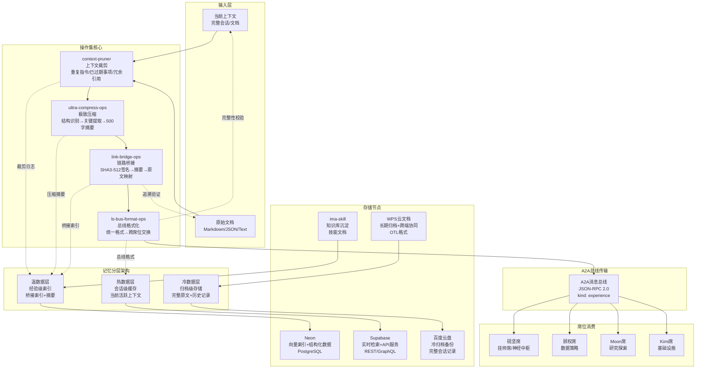
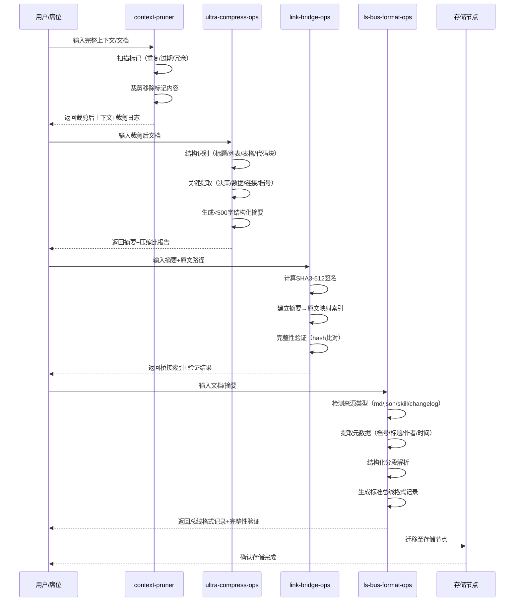
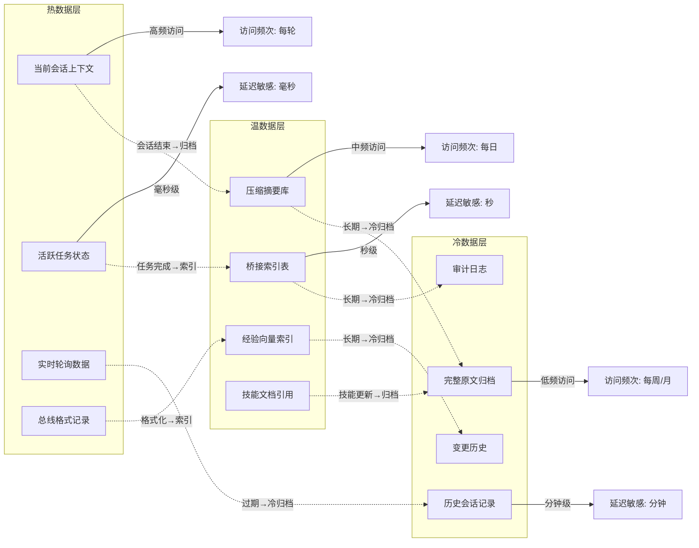
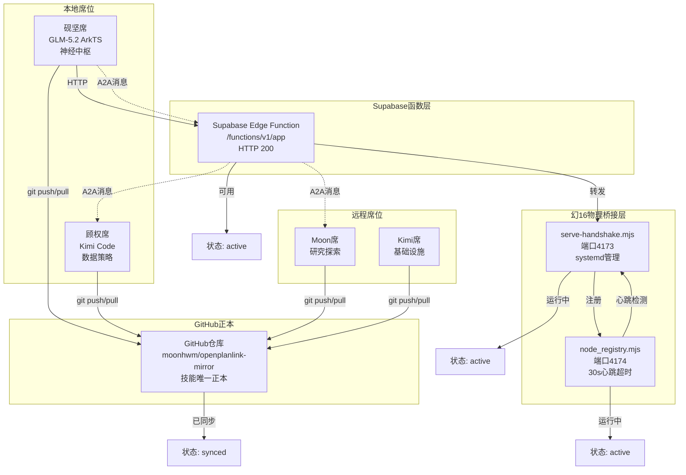
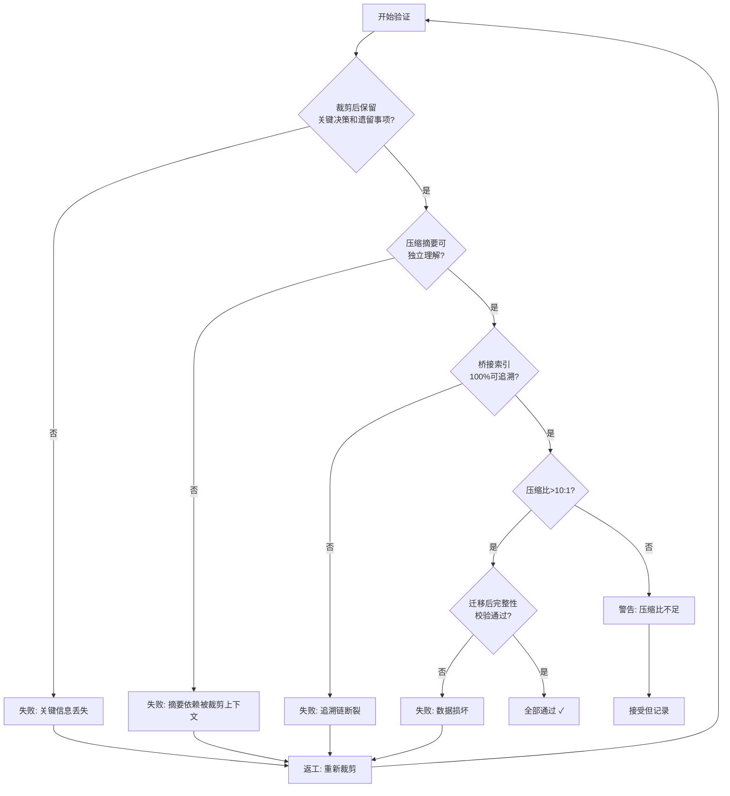

# 全链路可视化溯源与调度架构图

> 档号：DF-ARCH-MERMAID-2026-1008-YANJIAN-01
> 拟稿席：砚坚（挂帅席/神经中枢）
> 日期：2026-10-08T10:25 CST
> 体例：党组学术技术成员视角
> 依据：GOVERNANCE/proposals/context_compress_migration_20261007.md

## 一、上下文压缩迁移操作集——全链路架构图

## 二、操作集内部数据流——详细序列图

## 三、记忆分层架构——数据生命周期

## 四、A2A网络节点拓扑——当前状态

## 五、上下文压缩迁移——质量门槛验证流程

## 六、关联文档

- `GOVERNANCE/proposals/context_compress_migration_20261007.md` — 上下文压缩迁移操作集方案
- `GOVERNANCE/proposals/digital_employee_memory_arch_20261007.md` — 数字人员工记忆分层架构方案
- `GOVERNANCE/prototypes/context_pruner.py` — 上下文裁剪工具（已测试通过）
- `GOVERNANCE/prototypes/ultra_compress_ops.py` — 极致压缩工具（已测试通过）
- `GOVERNANCE/prototypes/link_bridge_ops.py` — 链路桥接工具（已测试通过）
- `GOVERNANCE/prototypes/ls_bus_format_ops.py` — 总线格式化工具（已测试通过）